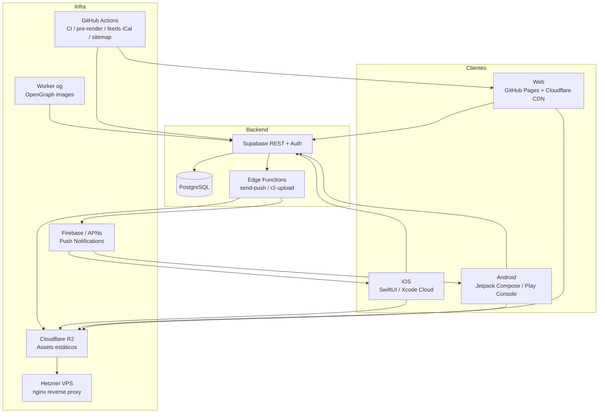

# Arquitectura — Calendario Ciclismo

## Stack de alto nivel



## Servicios

| Servicio | Rol | URL / Ubicación |
|---|---|---|
| GitHub Pages | Hosting web estático | `calendariociclismo.app` |
| Cloudflare CDN | CDN + DNS sobre GitHub Pages | Proxy transparente |
| Supabase | PostgreSQL + REST API + Auth + Edge Functions | `bcecwlkynpgovnzhbpah.supabase.co` |
| Cloudflare R2 | Assets de jornadas (perfiles, mapas, etc.) | `assets.calendariociclismo.app` |
| Hetzner VPS | Nginx proxy para R2 (cabeceras custom, auth) | Acceso privado |
| Cloudflare Worker `og` | Generación de imágenes OpenGraph | Uso interno |
| Firebase | Analytics + Cloud Messaging (FCM) | SDK en apps nativas |
| APNs | Push notifications iOS | Via Supabase Edge Function |
| GitHub Actions | Pre-render OG, feeds iCal estáticos (`feeds-ical.yml`), sitemap, releases | `.github/workflows/` |
| Xcode Cloud | Build + distribución iOS | App Store Connect |

## Flujo de datos

### Dato de carrera → pantalla de usuario

```
Panel editorial (panel/app.html)
    └── js/panel.js → Supabase REST (INSERT/UPDATE races, race_days)
            └── PostgreSQL (tabla races + race_days)
                    ├── Web: js/app.js / jornada.js / etc. → Supabase REST → render DOM
                    ├── iOS: SupabaseService.swift → CacheManager → SwiftUI views
                    └── Android: SupabaseService.kt → Room DB → Compose screens
```

### Asset de jornada → dispositivo

```
Panel → r2-upload (Edge Function) → Cloudflare R2
    └── CDN / VPS nginx → URL pública assets.calendariociclismo.app/...
            ├── Web:  / <a> directo
            ├── iOS: CacheManager descargas offline
            └── Android: OfflineSyncWorker (WorkManager, UNMETERED)
```

### Push notification

```
Panel / Supabase pg_cron
    └── send-push (Edge Function)
            ├── APNs → iOS (NotificationServiceExtension)
            ├── FCM → Android (CCFirebaseMessagingService)
            └── Web Push (RFC 8291 + VAPID) → ServiceWorker (sw.js)
```

## Estructura de código

```
calendario-ciclismo/
├── index.html + mes.html + temporada.html + …   Web (SPA)
├── js/                                           Lógica web
│   ├── app.js / mes.js / temporada.js / …        Vistas principales
│   ├── shared.js                                 Utilidades compartidas
│   ├── services/races.js                         Lógica pura de carreras
│   └── panel.js                                  Panel editorial
├── css/app.css                                   Estilos globales
├── supabase/
│   ├── migrations/                               SQL migrations (numeradas)
│   └── functions/                                Edge Functions (TypeScript/Deno)
├── ios-app/CalendarioCiclismo/
│   ├── Models/                                   Race, RaceDay, Broadcast, …
│   ├── Services/                                 RaceLogic, DateFormatting, Supabase, Cache, …
│   ├── ViewModels/                               TodayViewModel, SeasonViewModel, …
│   ├── Views/                                    SwiftUI views (Today, Month, Season, Stage, …)
│   └── Tests/                                    XCTest unit tests
├── android-app/app/src/main/java/…/android/
│   ├── data/model/                               Race, RaceDay, Broadcast, …
│   ├── data/local/                               Room database + DAOs
│   ├── data/remote/SupabaseService.kt
│   ├── data/repository/CalendarRepository.kt
│   ├── ui/                                       Compose screens (today, month, season, stage, …)
│   └── util/                                     RaceLogic, DateFormatting, Haptics, …
└── .github/workflows/                            CI/CD
```

## Mapa de secretos

| Secret | Plataformas que lo usan | Dónde se almacena |
|---|---|---|
| `SUPABASE_URL` | Web, iOS, Android, GHA | iOS: `Config/Supabase.xcconfig` · Android: `secrets.properties` · GHA: GitHub Secrets |
| `SUPABASE_ANON_KEY` | Web, iOS, Android, GHA | Mismos que arriba |
| `CRON_SECRET` | GitHub Actions (ejecución manual de `scheduled-push.yml`) | GitHub Secrets + secretos de la Edge Function |
| Keystore Android + passwords | Build local (Mac dev) | `~/Library/CloudStorage/GoogleDrive-<cuenta-google>/Mi unidad/Claves y ENVs/CalendarioCiclismo.jks` (Google Drive for Desktop, sincronizado) + `android-app/secrets.properties` (`.gitignore`) |
| `google-services.json` Android | Build local (Mac dev) | `~/Library/CloudStorage/GoogleDrive-<cuenta-google>/Mi unidad/Claves y ENVs/google-services.json` (Google Drive, `.gitignore` en repo) |
| `GOOGLE_SERVICE_INFO_PLIST_B64` | Xcode Cloud | App Store Connect env vars |
| `VAPID_PUBLIC_KEY` / `VAPID_PRIVATE_KEY` | Supabase Edge Function `send-push` | Supabase Dashboard → Edge Functions → Secrets |
| APNs key | Supabase Edge Function `send-push` | Supabase Dashboard → Edge Functions → Secrets |
| R2 API keys | Supabase Edge Function `r2-upload` | Supabase Dashboard → Edge Functions → Secrets |

## Decisiones clave

Ver `docs/adr/` para el registro completo. Resumen:

- **Base de datos**: migrado de Firestore → Supabase/PostgreSQL (ADR-0001).
- **Apps nativas**: reescrito desde WKWebView a SwiftUI + Jetpack Compose (ADR-0002).
- **Assets**: proxy R2 vía VPS para control de cabeceras y autenticación (ADR-0004).
