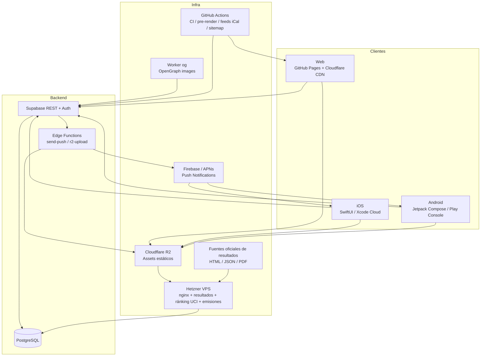

# Arquitectura — Calendario Ciclismo

## Stack de alto nivel


```mermaid
graph TB
    subgraph Clientes
        WEB[Web\nGitHub Pages + Cloudflare CDN]
        IOS[iOS\nSwiftUI / Xcode Cloud]
        AND[Android\nJetpack Compose / Play Console]
    end

    subgraph Backend
        SB[Supabase REST + Auth]
        DB[(PostgreSQL)]
        EF[Edge Functions\nsend-push / r2-upload]
    end

    subgraph Infra
        RS[Fuentes oficiales de resultados\nHTML / JSON / PDF]
        R2[Cloudflare R2\nAssets estáticos]
        VPS[Hetzner VPS\nnginx + resultados + ránking UCI + emisiones]
        WK2[Worker og\nOpenGraph images]
        GHA[GitHub Actions\nCI / pre-render / feeds iCal / sitemap]
        FCM[Firebase / APNs\nPush Notifications]
    end

    WEB --> SB
    IOS --> SB
    AND --> SB
    SB --> DB
    SB --> EF
    EF --> R2
    WEB --> R2
    IOS --> R2
    AND --> R2
    R2 --> VPS
    RS --> VPS
    VPS --> DB
    WK2 --> SB
    GHA --> SB
    GHA --> WEB
    EF --> FCM
    FCM --> IOS
    FCM --> AND
```

## Servicios

| Servicio | Rol | URL / Ubicación |
|---|---|---|
| GitHub Pages | Hosting web estático | `calendariociclismo.app` |
| Cloudflare CDN | CDN + DNS sobre GitHub Pages | Proxy transparente |
| Supabase | PostgreSQL + REST API + Auth + Edge Functions | `bcecwlkynpgovnzhbpah.supabase.co` |
| Cloudflare R2 | Assets de jornadas (perfiles, mapas, etc.) | `assets.calendariociclismo.app` |
| Hetzner VPS | Nginx proxy para R2, resultados, ránking UCI y observación de emisiones oficiales | Acceso privado · `/opt/calendario-ciclismo` |
| Cloudflare Worker `og` | Generación de imágenes OpenGraph | Uso interno |
| Firebase | Analytics + Cloud Messaging (FCM) | SDK en apps nativas |
| APNs | Push notifications iOS | Via Supabase Edge Function |
| GitHub Actions | CI/CD, pre-render OG, feeds iCal, sitemap, releases y fallback manual de resultados | `.github/workflows/` |
| Xcode Cloud | Build + distribución iOS | App Store Connect |

## Flujo de datos

### Dato de carrera → pantalla de usuario

```
Panel editorial (panel/app.html)
    └── js/panel/ → Supabase REST (INSERT/UPDATE races, race_days)
            └── PostgreSQL (tabla races + race_days)
                    ├── Web: js/app.js / jornada.js / etc. → Supabase REST → render DOM
                    ├── iOS: SupabaseService.swift → CacheManager → SwiftUI views
                    └── Android: SupabaseService.kt → Room DB → Compose screens
```

### Asset de jornada → dispositivo

```
Panel → r2-upload (Edge Function) → Cloudflare R2
    └── CDN / VPS nginx → URL pública assets.calendariociclismo.app/...
            ├── Web:  / <a> directo
            ├── iOS: CacheManager descargas offline
            └── Android: OfflineSyncWorker (WorkManager, UNMETERED)
```

### Push notification

```
Panel / Supabase pg_cron
    └── send-push (Edge Function)
            ├── APNs → iOS (NotificationServiceExtension)
            ├── FCM → Android (CCFirebaseMessagingService)
            └── Web Push (RFC 8291 + VAPID) → ServiceWorker (sw.js)
```

### Resultado oficial → dispositivos

```
Fuentes oficiales (HTML / JSON / PDF)
    └── Hetzner VPS: systemd timer → results-vps-runner.mjs
            ├── dataride-live-linker.mjs (cada 5 min, carreras actuales sin fuente)
            │       └── enlace UCI + volcado inmediato de la jornada actual
            └── results-cron.mjs --configured
                    └── fetcher por cronometrador → contrato JSON → upsert
                    └── PostgreSQL (race_uci_stages + race_uci_results)
                            ├── Web → lectura en vivo desde Supabase
                            ├── iOS → SupabaseService
                            └── Android → SupabaseService
```

El panel habilita y delimita las ventanas por carrera o jornada. El watcher fija
la cadencia según la capacidad de la fuente. Los botones manuales insertan una
solicitud en una cola privada de PostgreSQL que el mismo timer reclama. GitHub
Actions conserva el script como fallback manual, sin programación automática.

El enlazador live solo crea enlaces para carreras del día sin ninguna fila previa
en `race_uci_links`. Una coincidencia ambigua, una colisión de competición o una
fuente ya enlazada no se modifica automáticamente.

El ránking UCI de equipos usa un servicio separado del VPS. DataRide se consulta
cada hora durante lunes y martes y una vez el miércoles; una fecha ya almacenada
no provoca una nueva escritura.

HBO Max, RTVE, EITB, Sporza y RTBF se consultan con un servicio y un rol PostgreSQL
separados. El modo de aplicación exige dos observaciones estables, fuente oficial, emparejamiento
único y ausencia de ediciones manuales concurrentes; nunca elimina emisiones.

## Estructura de código

```
calendario-ciclismo/
├── index.html + mes.html + temporada.html + …   Web (SPA)
├── js/                                           Lógica web
│   ├── app.js / mes.js / temporada.js / …        Vistas principales (entradas de página en la raíz)
│   ├── shared.js                                 Utilidades compartidas
│   ├── services/races.js                         Lógica pura de carreras
│   ├── cx/                                       Módulos de ciclocross (referencia: docs/memory/ciclocross.md)
│   ├── results/                                  Módulos de resultados (DOM, tiempos, IRM, ranking UCI)
│   ├── stage/                                    Módulos de jornada y perfil (elevación, puertos, digitalizador)
│   ├── startlist/                                Módulos de inscritos (datos, importación, contrato de fuente)
│   └── panel/                                    Panel editorial (entrada: main.js)
├── css/app.css                                   Estilos públicos comunes (índice y puntos de corte en su cabecera)
├── css/resultados.css                            Resultados, ciclocross y orden de salida (tras app.css)
├── css/calendario.css                            Calendario: Temporada y Mes (tras app.css)
├── supabase/
│   ├── migrations/                               SQL migrations (numeradas)
│   └── functions/                                Edge Functions (TypeScript/Deno)
├── scripts/results-fetchers/                      Watcher, fetchers y upsert de resultados
├── scripts/broadcasts-sync/                       Observación y sincronización de emisiones
├── deploy/results-vps/                            Unidades systemd de resultados
├── deploy/uci-ranking-vps/                        Unidades systemd del ránking UCI
├── deploy/broadcasts-vps/                         Unidades systemd de emisiones
├── ios-app/CalendarioCiclismo/
│   ├── Models/                                   Race, RaceDay, Broadcast, …
│   ├── Services/                                 RaceLogic, DateFormatting, Supabase, Cache, …
│   ├── ViewModels/                               TodayViewModel, SeasonViewModel, …
│   ├── Views/                                    SwiftUI views (Today, Month, Season, Stage, …)
│   └── Tests/                                    XCTest unit tests
├── android-app/app/src/main/java/…/android/
│   ├── data/model/                               Race, RaceDay, Broadcast, …
│   ├── data/local/                               Room database + DAOs
│   ├── data/remote/SupabaseService.kt
│   ├── data/repository/CalendarRepository.kt
│   ├── ui/                                       Compose screens (today, month, season, stage, …)
│   └── util/                                     RaceLogic, DateFormatting, Haptics, …
└── .github/workflows/                            CI/CD
```

## Mapa de secretos

| Secret | Plataformas que lo usan | Dónde se almacena |
|---|---|---|
| `SUPABASE_URL` | Web, iOS, Android, GHA | iOS: `Config/Supabase.xcconfig` · Android: `secrets.properties` · GHA: GitHub Secrets |
| `SUPABASE_ANON_KEY` | Web, iOS, Android, GHA | Mismos que arriba |
| `CRON_SECRET` | GitHub Actions (ejecución manual de `scheduled-push.yml`) | GitHub Secrets + secretos de la Edge Function |
| Keystore Android + passwords | Build local (Mac dev) | `~/Library/CloudStorage/GoogleDrive-<cuenta-google>/Mi unidad/Claves y ENVs/CalendarioCiclismo.jks` (Google Drive for Desktop, sincronizado) + `android-app/secrets.properties` (`.gitignore`) |
| `google-services.json` Android | Build local (Mac dev) | `~/Library/CloudStorage/GoogleDrive-<cuenta-google>/Mi unidad/Claves y ENVs/google-services.json` (Google Drive, `.gitignore` en repo) |
| `GOOGLE_SERVICE_INFO_PLIST_B64` | Xcode Cloud | App Store Connect env vars |
| `VAPID_PUBLIC_KEY` / `VAPID_PRIVATE_KEY` | Supabase Edge Function `send-push` | Supabase Dashboard → Edge Functions → Secrets |
| APNs key | Supabase Edge Function `send-push` | Supabase Dashboard → Edge Functions → Secrets |
| R2 API keys | Supabase Edge Function `r2-upload` | Supabase Dashboard → Edge Functions → Secrets |
| `DATABASE_URL` del rol `cc_results_worker` | Watcher de resultados del VPS | `/etc/calendario-ciclismo/results.env` (`0640`, fuera del repo) + copia de recuperación privada |
| `BROADCASTS_DATABASE_URL` del rol `cc_broadcasts_login` | Sincronizador de emisiones del VPS | `/etc/calendario-ciclismo/broadcasts.env` (`0600`, fuera del repo) |
| `aviso_cc_webs_ccm_cce` (secreto compartido) | Aviso de cambio a las webs de la Clàssica y del club (`private.change_notice_tick`) | Supabase Vault de CC + secreto de la edge function `aviso-cc` de `webs-ccm-cce` |

## Decisiones de arquitectura

### Backend: Supabase gestionado

- El modelo de carreras, jornadas, emisiones, assets e inscritos es relacional
  y se consulta con filtros, joins y ordenaciones en SQL.
- Supabase reúne en un servicio PostgreSQL, PostgREST, Auth, Edge Functions y
  Storage. Se descartan un backend HTTP propio y la combinación de servicios
  separados por el coste de mantenimiento para un equipo de una persona.
- Consecuencias: el esquema se versiona en `supabase/migrations/`; cada columna
  nueva que consuman las apps exige migración SQL y, en Android, migración de
  Room. Las apps no usan Realtime: refrescan con carga periódica y
  pull-to-refresh.

### Apps nativas: SwiftUI y Jetpack Compose

- iOS (SwiftUI) y Android (Jetpack Compose) son nativas y leen Supabase REST
  directamente. Se descartan WebView, Capacitor/Ionic, React Native y Flutter.
- Motivos: push real (APNs/FCM mediante `send-push`), modo offline con caché
  local (`CacheManager`/`OfflineManager` en iOS; Room, `OfflineManager` y
  `OfflineSyncWorker` en Android), widgets, haptics, accesibilidad nativa y
  rendimiento de scroll.
- Consecuencias: cada cambio de presentación o de lógica se implementa en las
  dos plataformas y llega a los usuarios mediante release. La paridad funcional
  es un requisito de cada cambio. Detalles en `docs/memory/apps.md`.

### Assets: R2 detrás del proxy nginx del VPS

- Los assets de jornada y los logos se almacenan en Cloudflare R2 y se sirven
  desde `assets.calendariociclismo.app` a través de nginx en el VPS. La subida
  la firma la Edge Function `r2-upload`.
- Motivos: dominio propio, control de `Content-Type`, `Cache-Control` y CORS,
  ausencia de `Content-Disposition` para que iOS abra los PDF en línea, y
  posibilidad de añadir autenticación o transformaciones sin cambiar las URL.
  Además, el dominio no pasa por el proxy de Cloudflare (registro DNS en «solo
  DNS»): LaLiga bloquea las IP de Cloudflare y los assets dejarían de cargar
  en España durante los partidos. No activar el proxy ni rutas de Workers sobre
  `assets`; las cabeceras y transformaciones se añaden en nginx (ejemplo:
  `docs/runbooks/assets-canonical-vps.md`).
  Supabase Storage se descartó para assets por coste y límites de almacenamiento.
- Consecuencias: el VPS es un punto de fallo para los assets aunque R2 esté
  disponible, y la configuración de nginx se mantiene junto con el bucket. Si
  el VPS se retira, la alternativa prevista es un Cloudflare Worker con la misma
  URL pública.
- Excepción: los GPX del mapa (`route-gpx`) se sirven desde Supabase Storage
  porque el mapa los descarga con `fetch()` y necesita CORS directo.

### Servicios del VPS

- **Resultados automáticos y manuales**: watcher y cola privada en el VPS;
  GitHub Actions queda como fallback manual independiente.
- **Ránking UCI de equipos**: observación horaria lunes/martes en el VPS y pasada
  de seguridad el miércoles.
- **Emisiones oficiales**: servicio aislado con escrituras protegidas; toda
  acción queda auditada.

### Aviso de cambio a webs externas

- Las webs que reproducen datos de CC en un build estático
  (`classicacampdemorvedre.com`, `clubciclistaestivella.com`) reciben un POST
  desde la base de CC cuando cambia una carrera vigilada: disparadores por
  sentencia marcan una cola en `private` y `pg_cron` la envía agrupada con
  `pg_net`.
- Motivo: esas webs solo publican con actualizaciones y no consultan CC fuera
  del build.
- Diseño, contrato y operación: `docs/runbooks/aviso-cambio-webs-externas.md`.
