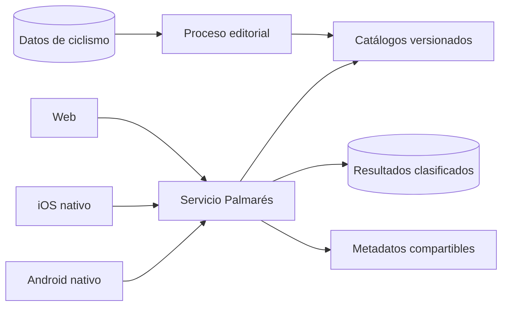

# Palmarés — documento de diseño y plan de ejecución

## Estado del documento

- Nombre de producto: **Palmarés**.
- Estado: planificación de producto previa al prototipo.
- Plataformas objetivo: web, iOS y Android.
- Modelo económico: gratuito, sin anuncios y sin funciones restringidas.
- Temporada principal de uso: noviembre-febrero, con disponibilidad permanente.

Este documento sustituye el estudio preliminar del simulador de carrera ciclista.
Conserva su motor reproducible y versionado, la carrera de varias temporadas, los
retos recurrentes, el catálogo versionado y la medición de retención. Reduce el
alcance inicial para producir partidas completas de tres a cinco minutos y aplaza el
manager de plantillas, el calendario íntegro y las cuentas multiplataforma.

## Decisión de producto

Palmarés será un simulador breve de la carrera completa de un ciclista profesional
real. El jugador elige uno de los corredores disponibles al inicio de 2026 y
dirige el resto de su trayectoria mediante objetivos, contratos y dilemas. La
partida termina con la retirada, un palmarés, una puntuación de legado y una
tarjeta compartible.

El producto se diferencia de un _fantasy_ y de un manager:

- No depende de resultados reales en curso y funciona durante el invierno.
- No exige administrar una plantilla, presupuestos ni entrenamientos diarios.
- Cada decisión representa una renuncia: liderazgo frente a equipo fuerte,
  objetivo inmediato frente a desarrollo, riesgo frente a regularidad.
- Los atributos iniciales son fijos, pero cada partida recibe una fuente de azar
  nueva y puede producir una trayectoria completamente distinta.
- Una carrera se completa en una sola sesión, sin registro obligatorio.
- El reto diario permite comparar decisiones bajo unas condiciones comunes sin
  imponer el mismo desarrollo ni el mismo resultado a todos.

## Objetivos

### Objetivos de producto

1. Generar una actividad ciclista válida cuando el calendario profesional tiene
   poca competición.
2. Conseguir que una primera partida empiece en menos de quince segundos y
   termine en tres a cinco minutos.
3. Producir historias distintas y resultados explicables, no una sucesión de
   tiradas aleatorias.
4. Crear recurrencia mediante reto diario, escenario semanal, rachas y mejores
   marcas.
5. Convertir cada final de carrera en una pieza compartible que funcione como
   distribución orgánica.
6. Mantener reglas, resultados y contenido idénticos en web, iOS y Android.

### Objetivos técnicos

1. Mantener un único motor autoritativo y versionado.
2. Garantizar resultados reproducibles para auditoría cuando se conserva la
   fuente de azar completa, sin reutilizarla entre partidas ordinarias.
3. Separar el catálogo del juego de las tablas editoriales operativas.
4. Permitir balancear atributos, rivales y puntuaciones sin publicar una nueva
   versión de las apps.
5. Limitar los datos personales y funcionar sin una cuenta general de usuario.

### Fuera del MVP

- Gestión completa de un equipo.
- Simulación de todas las carreras y etapas de una temporada real.
- Corredores creados o personalizados por el jugador.
- Corredores femeninos.
- Mercado de fichajes de todo el pelotón.
- Carreras multijugador en tiempo real.
- Animación en tiempo real de etapas.
- Economía, monedas, energía, cajas, compras o ventajas de pago.
- Chat y funciones sociales abiertas.
- Sincronización de partidas entre dispositivos.
- Modo histórico por décadas y modo director deportivo.

## Principios de diseño

### Decisiones escasas y legibles

Cada pantalla debe plantear una decisión principal. Una opción no puede ser mejor
en todos los ejes. Las consecuencias previsibles se muestran antes de decidir;
los resultados exactos permanecen inciertos.

### Aleatoriedad controlada, variable y trazable

Cada partida recibe una fuente de azar nueva, generada por el servicio y no
derivada únicamente del corredor, la fecha o el modo. Dos partidas con el mismo
corredor, catálogo y decisiones deben poder producir calendarios, forma,
incidentes, ofertas y resultados distintos.

La aleatoriedad opera dentro de rangos controlados por atributos, edad, equipo,
rol, preparación y decisiones. Puede producir sorpresas, pero no convertir de
forma habitual a un corredor claramente inadecuado en favorito de una prueba.

La fuente de azar se conserva para reproducir una partida terminada y resolver
errores, pero no se ofrece como una modalidad que repita siempre la misma
secuencia. Las pruebas de equilibrio recorrerán grandes conjuntos de fuentes de
azar; las pruebas fijas se limitarán a contratos técnicos e invariantes.

### Carrera completa, no sesión interminable

La retirada y el veredicto final forman parte del producto. No se emplean esperas,
energía ni tareas repetitivas para extender artificialmente una partida.

### Identidad ciclista

Las decisiones deben usar conceptos reconocibles del ciclismo: especialidad,
rol, calendario, forma, recuperación, liderazgo, fugas, órdenes de equipo,
contratos y objetivos. No se trasladarán términos de fútbol o automovilismo sin
adaptación.

### Resultado compartible

La tarjeta final debe explicar por sí sola quién fue el corredor, qué ganó, cuál
fue su especialidad y qué puntuación obtuvo. No incluirá marcas o fotografías sin
autorización.

## Público y sesión prevista

- Aficionado que conoce carreras y corredores, pero no utiliza juegos de gestión.
- Usuario habitual de Calendario Ciclismo durante la temporada.
- Usuario procedente de una tarjeta compartida que no conoce la aplicación.
- Edad y conocimiento del ciclismo no deben ser barreras de entrada.

Duración objetivo:

| Tramo | Duración objetivo |
| --- | ---: |
| Elección y lectura del corredor | 30-60 s |
| Carrera profesional | 2-3 min |
| Resumen y comparación | 30-60 s |
| Total | 3-5 min |

## Bucle principal

1. Elegir modalidad: carrera libre, reto diario o escenario semanal.
2. Elegir un corredor real de la lista disponible al inicio de 2026.
3. Consultar edad, año de debut, equipo, atributos, fortalezas y horizonte
   profesional estimado.
4. Elegir el primer objetivo deportivo.
5. Avanzar la temporada automáticamente hasta un momento relevante.
6. Elegir contrato, objetivo o respuesta a un dilema.
7. Consultar el resumen de temporada y la evolución del corredor.
8. Repetir entre ocho y doce decisiones profesionales.
9. Decidir o recibir la retirada según edad, estado y mercado.
10. Consultar palmarés, legado, arquetipo final y tarjeta compartible.
11. Repetir con el mismo corredor, elegir otro o acceder al reto recurrente.

Las temporadas sin decisiones relevantes se simulan juntas. El usuario no debe
confirmar acciones que no cambien el resultado.

## Modelo del corredor

### Atributos principales

Los atributos se almacenan y se muestran en una escala de **5 a 20**. El catálogo
de origen se normaliza desde el intervalo 50-85 mediante la transformación:

`atributo = clamp(5, 20, round(5 + (origen - 50) × 15 / 35))`

La lista inicial se cerrará con las cualidades que intervengan realmente en el
motor. El conjunto de trabajo es:

| Atributo | Interviene principalmente en |
| --- | --- |
| Llano | Colocación, viento, persecuciones y recorridos planos |
| Montaña | Puertos, llegadas en alto y generales montañosas |
| Colinas | Cotas, finales explosivos y clásicas quebradas |
| Descenso | Terreno técnico, lluvia y gestión del riesgo |
| Contrarreloj | Cronos y generales equilibradas |
| Prólogo | Esfuerzos breves contra el reloj |
| Adoquín | Monumentos y clásicas sobre pavé |
| Sprint | Velocidad máxima en llegadas masivas |
| Aceleración | Cambios de ritmo, grupos reducidos y ataques |
| Fondo | Grandes vueltas, Monumentos y rendimiento acumulado |
| Resistencia | Pérdida de rendimiento por esfuerzo y fatiga |
| Recuperación | Regularidad entre etapas y objetivos consecutivos |
| Fuga | Capacidad para entrar, sostener y resolver escapadas |

No se conservará una cualidad únicamente porque exista en la fuente. Antes de
publicar el catálogo se documentará su efecto concreto o se eliminará.

### Rasgos

Los rasgos modifican situaciones concretas sin convertirse en una segunda lista
de números. Ejemplos iniciales:

- Agresivo: más opciones de victoria y mayor riesgo de fracaso.
- Consistente: menor varianza y más resultados secundarios.
- Técnico: ventaja en descenso, lluvia y recorridos técnicos.
- Leal: mejora la relación con el equipo y reduce ofertas externas.
- Ambicioso: más oportunidades de liderazgo y mayor conflicto interno.
- Capitán de ruta: mejora resultados colectivos y valor como gregario.

Cada corredor empieza con un rasgo y puede obtener como máximo dos adicionales.

### Estado de carrera

- Edad.
- Nivel actual y potencial.
- Forma.
- Fatiga.
- Salud y lesiones.
- Moral.
- Reputación.
- Equipo, contrato y rol.
- Relación con equipo, líder y rivales.
- Palmarés y estadísticas acumuladas.
- Año de debut y temporadas profesionales disputadas.

Los valores derivados pueden permanecer ocultos, pero cada cambio debe explicarse
con lenguaje funcional: mejora, estable, cansado, descontento o lesionado.

## Catálogo inicial de corredores

El universo parte del pelotón masculino al inicio de 2026. Los atributos, edad,
año de debut, equipo y categoría se fijan en una versión inmutable del catálogo.
No se documentará públicamente el origen técnico de los valores importados.

El selector no mostrará todo el pelotón:

- Entre cinco y seis corredores destacados por cada equipo WorldTour.
- Entre dos y tres corredores destacados por cada ProTeam.
- Selección editorial versionada mediante `playable` y `selectionOrder`.
- Filtros por equipo, edad y especialidad, además de búsqueda por nombre.

Los demás corredores del catálogo 2026 siguen interviniendo como rivales aunque
no sean elegibles. A medida que avanza la simulación, los corredores reales se
retiran y el motor introduce nuevas generaciones ficticias para mantener un
pelotón completo. Estas nuevas generaciones no sustituyen ni modifican la
instantánea inicial de 2026.

La duración potencial de la partida depende de la edad, el año de debut, el
rendimiento y el historial físico. Un veterano puede disponer de una a cuatro
temporadas; una promesa puede desarrollar una carrera larga. El juego no garantiza
la misma longitud para todos los corredores.

## Carrera profesional

### Fases

| Fase | Edad orientativa | Función jugable |
| --- | ---: | --- |
| Desarrollo | Hasta 23 | Minutos, aprendizaje, cambios rápidos de nivel |
| Consolidación | 24-28 | Liderazgo, especialización y grandes objetivos |
| Madurez | 29-33 | Máximo rendimiento y gestión del calendario |
| Declive | Desde 34 | Adaptación de rol, último contrato y retirada |

Las edades son intervalos, no límites fijos. Potencial, lesiones, rendimiento y
decisiones pueden adelantar o retrasar cada fase. La partida no reconstruye las
temporadas anteriores a 2026: estas sirven como contexto para edad, experiencia,
reputación y margen de progresión.

### Ofertas y roles

Cada oferta expone cuatro variables:

- Fuerza del equipo.
- Calidad del calendario.
- Rol previsto: protegido, líder secundario, líder o gregario.
- Duración y estabilidad del contrato.

El salario no forma parte del MVP. La decisión debe concentrarse en oportunidades
deportivas. Un equipo fuerte facilita victorias colectivas, pero no garantiza
libertad; un equipo menor ofrece liderazgo con menor apoyo.

### Decisión de contrato

Cuando existe una propuesta, el jugador dispone de cuatro acciones:

- **Aceptar:** asegura equipo, duración y rol en las condiciones ofrecidas.
- **Esperar:** mantiene abierta la situación hasta el siguiente hito de mercado y
  asume el riesgo de retirada o empeoramiento de la oferta.
- **Negociar:** intenta mejorar duración o rol; puede mantener, mejorar o retirar
  la propuesta según reputación, edad, rendimiento y azar controlado.
- **Romper:** descarta la relación actual y entra plenamente en el mercado, con
  impacto en reputación y sin garantía de una oferta equivalente.

No se decide un contrato con una única tirada aislada. El motor combina valor
deportivo, necesidad del equipo, compatibilidad de rol, edad y estado del mercado.

### Objetivos de temporada

El corredor elige un bloque principal:

- Grandes vueltas.
- Vueltas de una semana.
- Monumentos y clásicas.
- Campeonatos.
- Etapas y fugas.
- Desarrollo o recuperación.

La especialidad condiciona la probabilidad, pero no impide objetivos atípicos.
Una mala elección debe producir un coste comprensible en forma, fatiga o rol.

### Fracaso y continuidad

Fracasar, perder el rol o quedarse sin renovación forman parte del juego. No deben
convertir la mayoría de partidas en una retirada inmediata sin decisiones:

- Un mal resultado aislado no termina una carrera.
- Antes de una retirada forzosa se evalúan renovación con menor rol, ofertas de
  ProTeam y contratos de una temporada.
- Los corredores jóvenes o en edad de consolidación reciben al menos una vía de
  continuidad razonable si el fracaso procede principalmente del azar.
- Esperar, negociar o romper puede eliminar esa protección cuando el jugador ha
  aceptado expresamente el riesgo.
- Los veteranos pueden terminar pronto si edad, rendimiento y mercado lo hacen
  coherente.
- Una trayectoria modesta conserva objetivos, hitos colectivos, victorias
  menores y un veredicto propio; no se presenta únicamente como una derrota.

El equilibrio debe permitir carreras fallidas y retiradas prematuras, pero
limitar la proporción de partidas que terminan antes de ofrecer una historia
completa. Este porcentaje se medirá por corredor, edad y causa.

### Dilemas

Los dilemas aparecen solo cuando alteran el estado o la historia. Familias
iniciales:

- Orden de equipo: trabajar, negociar o desobedecer.
- Riesgo: atacar, esperar o conservar.
- Salud: competir, descansar o abandonar un objetivo.
- Contrato: aceptar, esperar, negociar o romper.
- Calendario: encadenar objetivos o priorizar uno.
- Rivalidad: responder, ignorar o convertirla en cooperación.
- Retirada: continuar, cambiar de rol o cerrar la carrera.

Cada dilema define requisitos, opciones, efectos visibles, efectos internos y
textos de resolución. El contenido se almacena fuera del código del motor.

## Simulación

### Contrato de aleatoriedad

Una simulación queda identificada por:

- `engineVersion`.
- `catalogVersion`.
- `mode`.
- `runSeed`, único y secreto para cada partida.
- `challengeConfig`, común cuando se trate de un reto.
- Corredor y configuración inicial.
- Lista ordenada de decisiones.

El servicio obtiene `runSeed` de una fuente criptográficamente segura. No se
reutiliza entre partidas y no se deriva solo de la fecha, el identificador del
corredor o el jugador. No se utilizarán `Math.random`, el reloj del dispositivo ni
datos mutables del catálogo público como fuente directa de resultados.

En lugar de consumir una secuencia global rígida, cada sorteo se deriva de una
clave estable como `runSeed + temporada + prueba + corredor + tipoDeSorteo`. Así,
añadir una comprobación en un punto del motor no desplaza todos los resultados
posteriores ni convierte las pruebas en una única película repetida.

Se guardan la fuente y las claves necesarias para auditoría. La reproducibilidad
es una propiedad técnica de una partida concreta; la variación entre partidas es
una propiedad obligatoria del producto.

### Resolución de una temporada

1. Calcular nivel efectivo por edad, progresión, forma, fatiga y salud.
2. Aplicar adecuación entre atributos, rol, objetivo y perfiles de carrera.
3. Construir un programa reducido de pruebas relevantes.
4. Resolver el rendimiento frente a rivales y equipos del catálogo versionado.
5. Aplicar incidentes dentro de límites definidos por rasgos y decisiones.
6. Actualizar reputación, rol, ofertas, relaciones y estado físico.
7. Generar un resumen narrativo a partir de hechos estructurados.

El resultado deportivo combina atributos ponderados en escala 5-20, adecuación al
recorrido, equipo, rol, preparación y una desviación aleatoria acotada. Los rangos
se calibrarán por tipo de prueba. Un favorito puede fallar y un corredor inferior
puede sorprender, pero la distribución de miles de partidas debe respetar las
diferencias de nivel.

El motor simula en detalle solo al corredor del usuario y a los rivales necesarios
para dar contexto. No mantiene una clasificación completa de todo el pelotón.

### Perfiles de prueba

El catálogo del MVP necesita perfiles, no recorridos individuales completos:

- Gran vuelta montañosa.
- Gran vuelta equilibrada.
- Vuelta de una semana.
- Monumento adoquinado.
- Monumento de cotas.
- Clásica de fondo.
- Campeonato en circuito.
- Contrarreloj de campeonato.
- Etapa llana, media montaña, montaña y crono.

El catálogo asignará nombres reales a las carreras desde el MVP. El motor seguirá
funcionando con identificadores internos y nombres de presentación separados para
permitir versionado y traducción.

### Puntuación de legado

La puntuación final combina:

- Victorias y puestos de honor ponderados por prestigio.
- Generales, etapas, Monumentos y campeonatos.
- Regularidad y longevidad.
- Contribución colectiva cuando el corredor actúa como gregario o capitán.
- Dificultad del escenario.
- Hitos excepcionales y diversidad del palmarés.

No se conceden puntos directos por pulsar una opción. La decisión cambia las
condiciones que producen resultados. Los pesos exactos se fijarán mediante
simulaciones masivas y pruebas con usuarios.

La pantalla final muestra puntuación, percentil dentro de la modalidad y un
veredicto. El percentil se calcula únicamente contra partidas compatibles en
versión, modo y escenario.

## Modalidades

### Carrera libre

- Partidas ilimitadas.
- Fuente de azar nueva generada por el servicio en cada partida.
- Permite repetir con el mismo corredor sin repetir su trayectoria.
- Conserva localmente las últimas partidas y la mejor puntuación.
- No afecta a clasificaciones competitivas.

### Reto diario

- Mismo corredor o conjunto elegible, condiciones iniciales, catálogo y reglas
  para todos.
- `runSeed` distinto para cada participante; el reto comparte condiciones, no una
  secuencia completa de resultados.
- El servicio asigna `runSeed` desde un conjunto amplio calibrado previamente
  dentro de una misma banda de dificultad, evitando tanto la película única como
  diferencias desproporcionadas de fortuna entre participantes.
- Un resultado clasificado por perfil ligero y día.
- Los intentos posteriores son posibles, pero quedan marcados como práctica.
- Reinicio a las 00:00 de `Europe/Madrid`.
- Clasificación diaria y archivo de resultados propios.
- Racha por participación, no por victoria.

El reto incluye azar y, por tanto, la clasificación mide decisiones, adaptación y
fortuna dentro de los mismos rangos. No se presentará como una comparación
matemáticamente idéntica. El volumen de participantes y la repetición a lo largo
de varios retos reducen el efecto de una partida extrema. Si las simulaciones
detectan diferencias residuales relevantes entre fuentes de azar, la puntuación
clasificada se normaliza mediante el coeficiente de dificultad calculado para el
`runSeed`, mientras que el palmarés visible conserva su resultado bruto.

### Escenario semanal

- Condición inicial y objetivo específico.
- Disponible de lunes 00:00 a domingo 23:59 en `Europe/Madrid`.
- Un resultado clasificado; repeticiones de práctica posteriores.
- Doce escenarios preparados antes de la campaña de invierno.

Ejemplos:

- Convertir una promesa de montaña en ganador de gran vuelta.
- Salvar la carrera de un veterano sin contrato.
- Ganar un Monumento partiendo como gregario.
- Maximizar el palmarés sin abandonar un único equipo.
- Recuperarse de una lesión en el inicio de la madurez.

### Modos posteriores

- Décadas históricas.
- Director deportivo.
- Draft de leyendas.
- Retos tácticos de fuga, sprint, abanicos, montaña y contrarreloj.
- Ligas privadas cuando exista identidad de usuario adecuada.

## Contenido y versionado

### Catálogos separados

Palmarés no consultará directamente las tablas vivas de carreras, inscritos o
resultados durante una partida. Un proceso editorial construirá un catálogo de
juego inmutable con:

- Equipos reales de 2026.
- Corredores reales de 2026 y nuevas generaciones simuladas.
- Perfiles de prueba.
- Curvas de edad y progresión.
- Dilemas y requisitos.
- Plantillas narrativas.
- Pesos de puntuación.
- Escenarios.

Cada publicación crea una `catalogVersion`. Las partidas terminan siempre con la
versión con la que empezaron. Una versión puede dejar de aceptar nuevas partidas
sin impedir la validación de partidas ya iniciadas durante su periodo de soporte.

### Catálogo 2026

El juego tendrá su propia instantánea de corredores, equipos, atributos, edades,
años de debut y carreras. No consultará durante una partida las tablas vivas de
Calendario Ciclismo ni servicios externos. El origen técnico de la importación no
se publica en este documento ni en la interfaz.

Las tablas editoriales existentes pueden proporcionar identificadores y nombres,
pero el catálogo jugable se revisa, transforma a escala 5-20 y publica como una
versión independiente. Cada cambio de selección o atributo crea una versión
nueva; no altera partidas ya iniciadas.

### Narrativa

Los textos proceden de plantillas con variables estructuradas. No se genera texto
libre mediante IA durante la partida. Esto garantiza tono, traducción, coste,
moderación y reproducibilidad.

Cada hecho narrativo dispone al menos de:

- Identificador estable.
- Requisitos.
- Concordancia adecuada para corredores masculinos en español e inglés.
- Traducción española e inglesa.
- Variables permitidas.
- Prioridad y reglas para evitar repeticiones.

## Experiencia de usuario

### Entrada

Palmarés será una sección principal desde su lanzamiento:

- URL canónica web: `/palmares-juego/`.
- Cuarta pestaña, inmediatamente antes de Calendario, durante la temporada.
- A partir del 20 de octubre pasa a la segunda posición, inmediatamente después
  de Hoy, durante la campaña de invierno. La fecha de retorno a la cuarta
  posición se controla mediante configuración remota de campaña.
- En iOS y Android la navegación usa identificadores estables, no índices
  numéricos, para que el cambio de orden no rompa deep links ni estado.
- Android retirará Ajustes de la barra inferior y lo mantendrá accesible desde la
  cabecera o menú, evitando una barra de seis pestañas.

Además se promocionará mediante:

- Tarjeta destacada en Hoy.
- Enlace desde resultados o fichas cuando exista una relación editorial útil.
- Notificación semanal voluntaria para el escenario, después de añadir una
  categoría de notificación específica.

La pantalla inicial muestra un botón principal para jugar, accesos al reto diario,
escenario semanal, clasificaciones y partidas locales, además de un contador
visible de carreras completadas. También puede mostrar participantes del reto
vigente y las primeras posiciones sin obligar a abrir el ranking completo.

### Flujo de pantallas

1. Portada.
2. Modalidad.
3. Selector de corredor por equipo, especialidad o búsqueda.
4. Ficha inicial con atributos 5-20, edad, debut, equipo y horizonte estimado.
5. Línea temporal con decisión y resumen de temporada.
6. Contrato, objetivo o dilema cuando corresponda.
7. Retirada.
8. Palmarés y tarjeta.
9. Comparación, clasificación, compartir o repetir.

No se incluirá tutorial separado. La primera partida incorpora ayuda contextual
breve y descartable.

### Tarjeta compartible

Contenido mínimo:

- Nombre real del corredor elegido.
- Equipo inicial, país y especialidad.
- Años de carrera.
- Tres logros principales.
- Puntuación y veredicto.
- Modalidad y fecha cuando sea un reto.
- Marca Palmarés / Calendario Ciclismo.
- Enlace canónico para jugar el mismo reto, sin incluir decisiones privadas.

El alias del participante puede aparecer en la tarjeta si lo ha creado para el
reto, pero no forma parte de la URL. La tarjeta se genera en el dispositivo o
mediante un identificador opaco y expirable.

### Perfil ligero y clasificaciones

El MVP no introducirá todavía una cuenta general de Calendario Ciclismo. La
primera vez que se participe en una modalidad clasificada:

1. El usuario elige un alias público de longitud limitada.
2. El servicio crea un `playerId` aleatorio y entrega un secreto de dispositivo.
3. Web lo conserva en almacenamiento local; iOS en Keychain y Android en
   almacenamiento cifrado.
4. Todas las escrituras posteriores pasan por el servicio Palmarés, que valida el
   secreto y la elegibilidad del intento.

El alias tendrá normalización, filtro básico, límite de cambios y opción de
generación automática. No se solicitarán nombre real, correo ni fecha de
nacimiento.

Las mejores puntuaciones se reflejan en una pantalla propia con:

- Clasificación del reto diario.
- Clasificación del escenario semanal.
- Mejores carreras libres por corredor y versión de catálogo.
- Posición del participante y percentil.
- Número de participantes únicos y partidas completadas.

La portada de Palmarés mostrará el total acumulado de partidas completadas, no de
partidas iniciadas. El contador se actualizará mediante un agregado servidor para
evitar contar reintentos, errores o recargas como carreras terminadas.

Una cuenta recuperable con correo, Apple o Google se evaluará posteriormente para
sincronización entre dispositivos. Antes de habilitar usuarios públicos en
Supabase Auth será obligatorio auditar todas las políticas históricas que todavía
equiparen `authenticated` con administración.

### Identidad visual

Palmarés tendrá identidad propia dentro del sistema visual de Calendario Ciclismo,
sin adoptar una interfaz separada:

- Mismos tokens de color, tipografía, espaciado, radios, sombras y temas claro y
  oscuro que web y apps.
- Mismos patrones de cabecera, pestañas, tarjetas, filtros, banderas, botones y
  hojas modales.
- El color dorado se reserva para palmarés, hitos y puntuaciones; el azul de la
  aplicación mantiene navegación y acciones principales.
- La ficha del corredor, la línea temporal y la vitrina constituyen los tres
  componentes específicos del juego.
- La tarjeta compartible emplea la misma marca, tipografía y jerarquía que las
  tarjetas editoriales del producto.
- No se utilizan fotografías, logotipos o maillots de terceros salvo activos ya
  autorizados para este uso.

Antes del corte vertical se prepararán un logotipo o tratamiento tipográfico,
paleta semántica, selector de corredor, ficha de atributos, pantalla de temporada
y tarjeta final en móvil y escritorio.

### Accesibilidad

- Todas las decisiones son operables con teclado, VoiceOver y TalkBack.
- El color no es el único indicador de nivel, efecto o resultado.
- Las animaciones respetan reducción de movimiento.
- Los resúmenes disponen de una representación textual completa.
- Los gráficos de atributos incluyen valores o categorías accesibles.
- Objetivo mínimo WCAG 2.2 AA en web.

### Idiomas

Español e inglés forman parte del MVP en las tres plataformas. Identificadores,
reglas y resultados son independientes del texto presentado. No se concatenan
fragmentos que impidan adaptar género, número u orden gramatical.

## Arquitectura propuesta

### Restricciones existentes

- La web es estática y consume Supabase.
- iOS usa SwiftUI y Android usa Jetpack Compose.
- El ADR-0002 descarta WebView como arquitectura de las apps.
- No existe una cuenta general recuperable para cada usuario.
- Supabase Auth se utiliza principalmente para administración.
- Las funciones no pueden depender de `PremiumService.isSubscribed`; todas
  permanecen disponibles mediante `featuresUnlocked`.

### Componentes

### Motor autoritativo

El motor se desplegará como servicio TypeScript/Deno compatible con Supabase Edge
Functions. Web, iOS y Android comparten el mismo contrato HTTP y no reimplementan
las reglas de simulación.

Una llamada de avance recibe el token de partida y una decisión. El servicio:

1. Valida versión, modo, estado y opción.
2. Reconstruye o recupera el estado.
3. Ejecuta el siguiente paso reproducible para el `runSeed` de esa partida.
4. Devuelve estado visible, hechos, opciones siguientes y token actualizado.

El token debe ser opaco y estar firmado, o referenciar una fila inaccesible de
forma directa. El cliente no puede alterar atributos, `runSeed`, resultado ni
condición de intento clasificado.

### Persistencia inicial

- Partidas libres en curso: almacenamiento local del cliente más token firmado.
- Partidas clasificadas: registro servidor al iniciar y al terminar.
- Historial local: últimas partidas y mejores resultados.
- Perfil ligero: alias, identificador opaco, secreto rotatorio y fechas de uso.
- Resultados públicos: alias validado, corredor elegido, puntuación, percentil,
  versión y fecha.

No se promete recuperación tras borrar la app, limpiar el navegador o cambiar de
dispositivo. Esta limitación debe indicarse donde se consulta el historial.

### Aislamiento en Supabase

Palmarés utilizará el mismo proyecto de Supabase que Calendario Ciclismo, pero no
las mismas tablas ni el mismo espacio lógico. Se creará un esquema dedicado
`palmares` con su propio catálogo, perfiles, partidas, retos, clasificaciones y
agregados.

No se recomienda un segundo proyecto de Supabase para el MVP: duplicaría
operación, secretos, despliegues y observabilidad sin aportar una separación
necesaria. La división por esquema permite aislar permisos y conservar una única
infraestructura. Un proyecto separado solo se reconsiderará por volumen, costes o
necesidades jurídicas posteriores.

El esquema no ofrece escritura directa a `anon` ni `authenticated`. La Edge
Function constituye la única API de juego y realiza las operaciones servidor con
credenciales no expuestas al cliente. Todas las tablas tendrán RLS como defensa
adicional, privilegios mínimos explícitos y revocación de `PUBLIC`. Los listados,
contadores y rankings se devolverán mediante respuestas filtradas del servicio,
no mediante acceso directo a las filas internas.

### Entidades previstas

Los nombres son provisionales. Una migración posterior debe declarar privilegios
mínimos explícitos y evitar escritura directa desde `anon`.

| Entidad | Finalidad |
| --- | --- |
| `palmares.catalog_versions` | Versiones publicadas y periodos de soporte |
| `palmares.riders_2026` | Corredores, atributos 5-20, edad, debut y elegibilidad |
| `palmares.teams_2026` | Equipos y categoría de la instantánea inicial |
| `palmares.races` | Pruebas reales y perfiles usados por el motor |
| `palmares.players` | Perfil ligero, alias y secreto validable |
| `palmares.runs` | Fuente de azar, decisiones y resultado validado |
| `palmares.daily_challenges` | Condiciones compartidas de cada día |
| `palmares.weekly_scenarios` | Escenarios, vigencia y condición de éxito |
| `palmares.leaderboard_entries` | Puntuaciones compatibles y posición pública |
| `palmares.counters` | Partidas completadas y participantes agregados |
| `palmares.share_runs` | Resumen mínimo para enlaces y OpenGraph |

El catálogo de reglas puede almacenarse como JSON versionado en el repositorio o
en Storage. La base de datos conserva metadatos y versiones publicadas.

### Contrato mínimo de API

| Operación | Resultado |
| --- | --- |
| Obtener portada | Modalidades, reto, contadores y mejores puntuaciones compatibles |
| Crear perfil | `playerId`, alias validado y secreto de dispositivo |
| Actualizar alias | Alias normalizado sujeto a límite de cambios |
| Crear partida | Token, versión, `runSeed` interno, corredor y estado inicial |
| Aplicar decisión | Nuevo estado visible, hechos y opciones siguientes |
| Reanudar | Estado visible reconstruido desde un token válido |
| Finalizar | Palmarés, puntuación, veredicto y elegibilidad de ranking |
| Obtener ranking | Clasificación compatible y posición del alias |
| Obtener contadores | Partidas completadas y participantes del reto |
| Crear enlace compartible | Identificador opaco y metadatos mínimos |

Las respuestas incluyen un `schemaVersion` independiente de `engineVersion` para
permitir evolución compatible del contrato.

### Funcionamiento degradado

Palmarés requiere red en el MVP. Si el servicio no está disponible:

- La aplicación conserva el token local.
- Se ofrece reintento sin consumir otra decisión.
- No se crea una segunda partida clasificada.
- El resto de Calendario Ciclismo continúa operativo.

El modo completamente offline se estudiará después de validar la retención, ya
que implicaría compartir o duplicar el motor entre tres plataformas.

### Seguridad y abuso

- El cliente nunca escribe directamente puntuaciones.
- El servicio valida toda la secuencia de decisiones antes de clasificar.
- El `playerId` y su secreto limitan el primer intento clasificado; no constituyen
  una identidad recuperable y pueden restablecerse borrando los datos locales.
- Se aplican límites de frecuencia por instalación e IP sin convertirlos en una
  barrera para redes compartidas.
- Los rankings muestran únicamente alias normalizados y moderados.
- Los enlaces compartidos no exponen tokens de reanudación.
- Los logs excluyen nombres introducidos, tokens y decisiones completas salvo en
  trazas de depuración controladas.

No se presentará el ranking del perfil ligero como una competición resistente al
fraude. Las ligas y premios requieren cuentas recuperables y controles distintos.

## Nombres y contenido real

El MVP utilizará nombres reales de corredores, equipos y carreras. Palmarés se
presentará como un juego gratuito de entretenimiento no afiliado a equipos,
organizadores ni federaciones. Las valoraciones se tratarán como parámetros
editoriales del simulador.

La gratuidad y el carácter recreativo no autorizan por sí solos la reproducción
de cualquier activo. Fotografías, logotipos, maillots, escudos y obras gráficas de
terceros quedan excluidos salvo que exista permiso o una licencia aplicable. La
interfaz puede representar equipos y carreras mediante texto, país, categoría y
componentes visuales propios.

## Gratuidad y sostenimiento

- Todas las modalidades y repeticiones son gratuitas.
- No hay publicidad ni espacio reservado para publicidad.
- Amigo y Fundador no alteran probabilidades, intentos, clasificaciones o acceso.
- El reconocimiento cosmético puede mostrar un icono elegible junto al historial
  local o alias si la identidad futura permite hacerlo sin romper la igualdad.
- No se usan monedas, energía ni compras consumibles dentro del juego.

## Analítica

Los nombres deben coincidir entre GA4 web y Firebase iOS/Android cuando el evento
sea equivalente. No se envían nombre del corredor, token, alias público ni texto
de decisiones.

### Eventos mínimos

| Evento | Parámetros principales |
| --- | --- |
| `palmares_view` | `source`, `mode` |
| `palmares_run_start` | `mode`, `engine_version`, `catalog_version` |
| `palmares_rider_select` | `mode`, `rider_id`, `team_category`, `age_band` |
| `palmares_profile_create` | `source`, `alias_generated` |
| `palmares_decision` | `mode`, `decision_family`, `career_phase` |
| `palmares_run_complete` | `mode`, `rider_id`, `score_band`, `duration_band` |
| `palmares_run_abandon` | `mode`, `career_phase`, `last_step` |
| `palmares_daily_submit` | `challenge_date`, `score_band`, `rank_band` |
| `palmares_weekly_submit` | `scenario_id`, `success` |
| `palmares_replay` | `previous_mode`, `next_mode` |
| `palmares_share` | `mode`, `channel` |
| `palmares_resume` | `mode`, `career_phase` |
| `palmares_error` | `operation`, `error_code` |

`palmares_run_abandon` no puede depender de un evento de cierre de app poco
fiable. Se deriva cuando una partida iniciada permanece incompleta después del
intervalo definido.

### Indicadores

- Conversión de portada a inicio.
- Conversión del selector a inicio de carrera.
- Finalización de carrera.
- Duración mediana y percentiles.
- Repetición inmediata.
- Participación en reto diario.
- Retorno al día siguiente y a siete días.
- Uso de escenario semanal.
- Tasa de compartir.
- Distribución de especialidades, decisiones, resultados y puntuaciones.
- Distribución de corredores elegidos y longitud de carrera.
- Retiradas tempranas por edad, rendimiento, lesión o falta de contrato.
- Número de trayectorias distintas al repetir un mismo corredor.
- Errores por operación y plataforma.

### Umbrales iniciales de beta

Son criterios de decisión, no previsiones:

- Al menos 60 % de las carreras iniciadas llegan a la retirada.
- Mediana de duración entre tres y siete minutos.
- Al menos 20 % de quienes terminan inician otra partida en la misma sesión.
- Al menos 10 % de participantes del reto diario vuelven dentro de siete días.
- Ningún perfil inicial obtiene una puntuación mediana superior en más de 15 % al
  resto sin una razón de dificultad explícita.
- Al repetir cien veces un mismo corredor con decisiones equivalentes se obtienen
  al menos 95 huellas visibles distintas, calculadas sobre palmarés principal,
  equipos, lesiones relevantes y duración de carrera.
- Las retiradas tempranas por puro azar se mantienen por debajo del umbral que se
  establezca después de la simulación de catálogo.
- Menos de 1 % de partidas termina en un error no recuperable.

Si la finalización queda por debajo del umbral, se reduce el número de decisiones
antes de añadir contenido. Si la repetición es baja, se revisan variación,
consecuencias y tarjeta antes de construir modos adicionales.

## Plan de entrega

### Fase 0 — reglas y prueba de papel

Entregables:

- Catálogo masculino 2026 con corredores, equipos, edad y año de debut.
- Selección de 5-6 corredores por equipo WorldTour y 2-3 por ProTeam.
- Conversión documentada de atributos a escala 5-20 y selección de cualidades.
- Curvas de progresión, declive, retirada y entrada de nuevas generaciones.
- Veinte dilemas con opciones y efectos.
- Diez carreras completas calculadas manualmente o en hoja de cálculo.
- Especificación de `runSeed`, sorteos derivados y rangos de aleatoriedad.
- Esquema de puntuación provisional.
- Primer sistema visual y wireframes de las pantallas principales.

Criterio de salida:

- Cada opción presenta una compensación comprensible.
- Se pueden producir carreras de éxito, fracaso y trayectorias intermedias sin
  resultados incoherentes.
- Repetir un corredor no produce una secuencia visible fija.

### Fase 1 — motor y simulación masiva

Entregables:

- Motor sin interfaz.
- Catálogo de prueba versionado.
- Trazas reproducibles de cada partida concreta.
- Herramienta de simulación por lotes.
- Informe de equilibrio por perfil, edad, rol y estrategia.

Criterio de salida:

- Cero divergencias al reconstruir una partida con su `runSeed` registrado.
- Ninguna estrategia domina todas las modalidades.
- Cien mil carreras pueden analizarse sin estados imposibles.
- La distribución de resultados mantiene favoritos y permite sorpresas sin
  repetir trayectorias de forma sistemática.

### Fase 2 — corte vertical web

Entregables:

- Carrera libre completa en web responsive.
- Selector de corredor real, ficha 5-20, decisiones, temporadas, retirada y
  palmarés.
- Persistencia y reanudación local.
- Español e inglés.
- Accesibilidad básica y analítica.
- Tarjeta descargable local, todavía sin enlace público.
- Ruta canónica `/palmares-juego/` y sistema visual integrado con la web.

Criterio de salida:

- Prueba interna completa en móvil y escritorio.
- El flujo se entiende sin tutorial separado.
- Los errores de red se recuperan sin perder la partida.

### Fase 3 — recurrencia y beta

Entregables:

- Reto diario.
- Escenario semanal.
- Perfil ligero con alias.
- Registro autoritativo de resultados.
- Rankings diario, semanal y por corredor.
- Contadores de partidas completadas y participantes.
- Enlaces compartibles y OpenGraph.
- Panel o procedimiento editorial para publicar escenarios y catálogos.
- Beta limitada desde la web.

Criterio de salida:

- Se cumplen o se revisan explícitamente los umbrales de finalización, repetición
  y errores.
- El motor rechaza alteraciones de tokens y secuencias inválidas.

### Fase 4 — aplicaciones nativas

Entregables:

- Destino Palmarés en SwiftUI.
- Destino Palmarés en Jetpack Compose.
- Contrato y modelos con paridad entre plataformas.
- Historial local, compartir nativo, deep links, analítica y accesibilidad.
- Tarjeta destacada en Hoy en las tres plataformas.
- Palmarés como cuarta pestaña antes de Calendario y orden de invierno preparado.
- Ajustes fuera de la barra inferior de Android.
- Categoría de notificación voluntaria para escenario semanal.

Criterio de salida:

- Una misma partida de prueba presenta decisiones y resultado equivalentes en
  web, iOS y Android.
- Los flujos de error, reanudación y compartir están cubiertos.
- Las versiones y changelog de las apps se actualizan al implementar el código.

### Fase 5 — campaña de invierno

Entregables:

- Doce escenarios semanales revisados y traducidos.
- Calendario de publicación y notificaciones.
- Seguimiento semanal de equilibrio, errores y retención.
- Procedimiento para desactivar un escenario o catálogo defectuoso sin publicar
  nuevas apps.
- Informe de cierre con decisión sobre continuidad y modos posteriores.

Criterio de salida:

- Catálogo y escenarios preparados antes del inicio de la campaña.
- Existe responsable y procedimiento para cada incidencia operativa.

## Pruebas y validación

### Motor

- Reconstrucción exacta de partidas registradas mediante `runSeed`.
- Pruebas de propiedad sobre miles de fuentes de azar nuevas, no solo un conjunto
  pequeño de semillas fijas.
- Comprobación de diversidad: múltiples trayectorias para un mismo corredor y
  decisiones equivalentes.
- Propiedades: atributos dentro de 5-20, edad creciente, contratos válidos,
  retirada única y ausencia de resultados posteriores a la retirada.
- Simulación masiva por corredor, edad, estrategia y tipo de prueba.
- Reproducción de cualquier partida clasificada a partir de su registro.
- Compatibilidad con catálogos todavía soportados.

### API y seguridad

- Tokens alterados, expirados, reutilizados o pertenecientes a otro modo.
- Decisiones inexistentes o fuera de orden.
- Doble envío del mismo paso.
- Reintentos después de interrupciones.
- Límite de intento clasificado.
- Límites de frecuencia y respuestas degradadas.
- Privilegios SQL mínimos y ausencia de escritura pública directa.

### Interfaces

- Teléfonos pequeños, tabletas y escritorio.
- Tema claro y oscuro.
- Tamaños de texto ampliados.
- VoiceOver, TalkBack y teclado.
- Red lenta, pérdida de conexión y reanudación.
- Paridad de textos, decisiones y resultados entre plataformas.
- Tarjetas compartidas con y sin alias del participante.

### Contenido

- Dilemas sin opción dominante.
- Ausencia de combinaciones narrativas contradictorias.
- Traducciones completas.
- Lenguaje correcto para corredores masculinos.
- Revisión de nombres y exclusión de activos gráficos no autorizados.

## Riesgos y controles

| Riesgo | Control |
| --- | --- |
| Alcance próximo a un manager | Limitar el MVP a un corredor, programa reducido y 8-12 decisiones profesionales |
| El azar parece decidir la partida | Mostrar consecuencias, acotar la desviación por prueba y medir distribuciones |
| Semillas rígidas repiten siempre las pruebas | `runSeed` nuevo por partida, sorteos derivados independientes y pruebas multisemilla |
| Una especialidad domina | Simulación masiva por corredor y escenarios con perfiles variados |
| Repetición insuficiente | Priorizar diversidad de trayectorias, dilemas y reto diario antes de añadir profundidad |
| Fracaso demasiado temprano | Mercado de continuidad, objetivos alternativos y medición de retiradas por causa |
| Tres interfaces retrasan la salida | Validar primero en web; mantener apps nativas después del corte de beta |
| Fraude en rankings anónimos | Validación servidor, ranking sin premios y presentación no competitiva |
| Coste o latencia del servicio | Estado compacto, respuestas incrementales y pruebas de carga antes de apps |
| Nombres y activos reales | Uso textual recreativo y exclusión de fotografías, logotipos y maillots no autorizados |
| Alias ofensivo | Normalización, filtro, límite de cambios y alias generado |
| Dependencia de red dentro de apps | Reanudación segura y aislamiento respecto al resto de la aplicación |
| Contenido semanal insuficiente | Doce escenarios terminados antes de lanzar la campaña |

## Decisiones cerradas

- El producto se llama Palmarés.
- Será gratuito y sin anuncios.
- La primera experiencia será una carrera personal breve.
- El jugador elegirá un corredor masculino real del catálogo 2026.
- El selector ofrecerá 5-6 corredores por equipo WorldTour y 2-3 por ProTeam.
- Los atributos usarán escala 5-20 transformada desde el intervalo 50-85.
- Edad y año de debut condicionarán el margen de carrera restante.
- Se usarán nombres reales de corredores, equipos y carreras.
- Habrá carrera libre, reto diario y escenario semanal.
- Cada partida tendrá aleatoriedad propia dentro de rangos controlados.
- El motor será autoritativo, versionado y reproducible para auditoría.
- No se exigirá una cuenta general; el ranking usará un perfil ligero con alias.
- Las apps conservarán interfaces nativas; no se recuperará WebView.
- Palmarés será la cuarta pestaña, antes de Calendario, desde el lanzamiento.
- La web utilizará `/palmares-juego/`.
- El menú mostrará un contador de partidas completadas.
- El juego usará el mismo proyecto Supabase con esquema `palmares` aislado.
- El catálogo del juego estará separado de los datos editoriales vivos.

## Decisiones pendientes antes de la fase 1

1. Lista exacta de cualidades conservadas después de validar su función.
2. Selección exacta de corredores jugables por equipo.
3. Identidad visual y logotipo de Palmarés dentro del sistema existente.
4. Número exacto de decisiones según edad y longitud de carrera.
5. Pesos iniciales de puntuación y lista de veredictos.
6. Reglas del alias, número de cambios y moderación.
7. Fecha de retorno a la cuarta posición después de la campaña de invierno.
8. Política de conservación de perfiles, resultados y enlaces compartibles.

## Definición de MVP terminado

El MVP se considera terminado cuando una persona puede elegir sin cuenta general
un corredor masculino real de 2026, consultar sus atributos 5-20, completar una
trayectoria variable con decisiones significativas, recibir un palmarés auditable,
conservar su resultado y compartir una tarjeta. El reto registra un alias ligero,
publica clasificación, participantes y contador de partidas; las tres plataformas
presentan el mismo contrato y ninguna función depende de una compra o suscripción.
